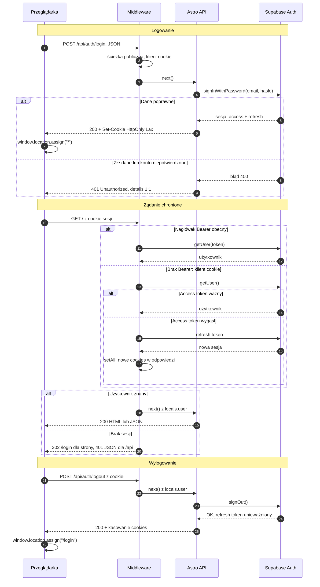
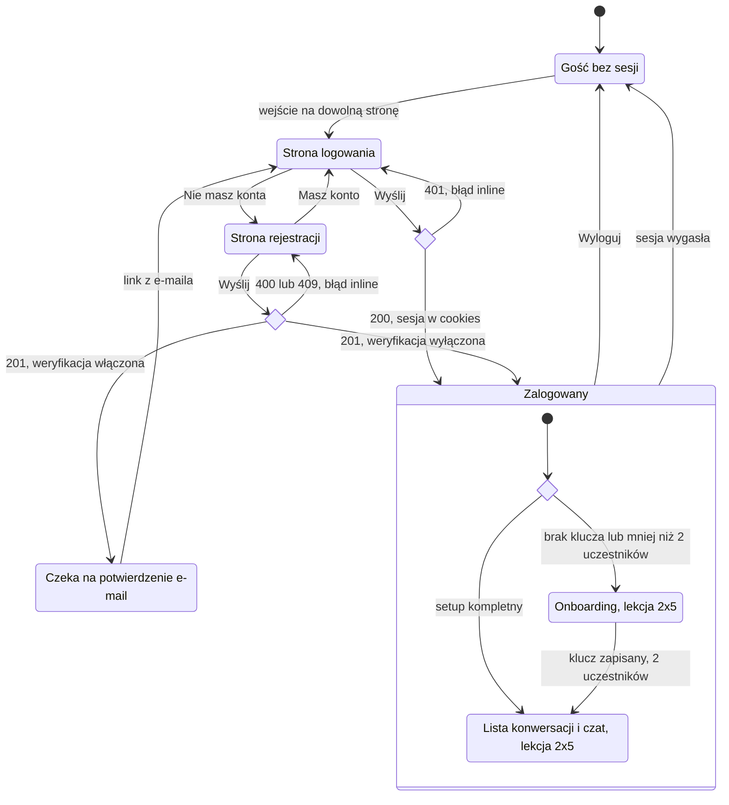
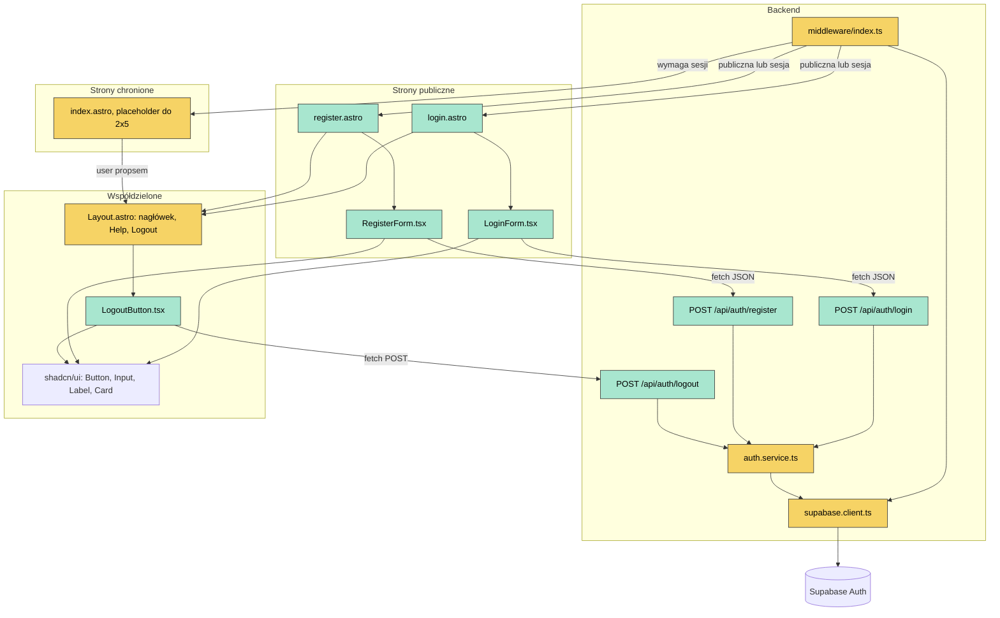

# Specyfikacja architektury uwierzytelniania - MindAgora (ap6)

Stan: 2026-09-12, lekcja 3x1 (Zad. 2). Źródło prawdy razem z kodem (`src/middleware`, `src/pages/api/auth`,
`src/lib/services/auth.service.ts`, `src/db/supabase.client.ts`) oraz PRD (ap2 §3.1, US-001…003, US-032/033)
i planem API (ap5 §2.6, §3, §8.5). Dokument opisuje architekturę i kontrakty, nie implementację.

## 0. Kontekst i decyzje

- **Co już jest (przed 3x1):** RLS na każdej tabeli, middleware weryfikujący `Authorization: Bearer <JWT>`,
  12 endpointów REST za autoryzacją, `user_settings` tworzone triggerem przy rejestracji, smoke suite curl
  (95 PASS) pozyskująca tokeny bezpośrednio z Supabase Auth.
- **Czego brakuje:** sesji przeglądarkowej, stron logowania i rejestracji, ochrony tras dla stron Astro,
  wylogowania, tej specyfikacji i diagramów.
- **E3 (2026-09-12): hybryda.** Przeglądarka dostaje sesję w cookies `HttpOnly` zarządzanych wyłącznie po stronie
  serwera (`@supabase/ssr`). API przyjmuje dodatkowo Bearer (klienci nieprzeglądarkowi, smoke testy). Obie ścieżki
  kończą się tym samym `locals.user` + `locals.supabase`.
- **B21 (2026-09-12): odzyskiwanie hasła poza MVP** (PRD §4.1). Zmiana hasła i usunięcie konta również poza MVP.
- **Zasięg ochrony (PRD §3.1):** cała aplikacja za sesją. Publiczne wyłącznie `/login`, `/register`,
  `POST /api/auth/login`, `POST /api/auth/register` i statyki.
- **Ścieżki:** `/login`, `/register` (strony); `/api/auth/login`, `/api/auth/register`, `/api/auth/logout` (API).
  Kursowe `/auth/*` odrzucone: krótsze ścieżki są od dawna w whitelist middleware i w PRD („login page").
- **Bez OAuth, bez magic linków, bez MFA.** E-mail + hasło (min. 6 znaków, `minimum_password_length`).
- **Weryfikacja e-mail:** wyłączona lokalnie (`enable_confirmations = false`), włączona na produkcji (domyślne
  Supabase). Aplikacja obsługuje oba warianty tym samym kodem (`confirmation_required` w odpowiedzi rejestracji).

## 1. Architektura interfejsu użytkownika

### 1.1. Strony Astro (SSR, `output: "server"`)

| Strona                     | Dostęp                 | Odpowiedzialność                                                                                                                                                            |
| -------------------------- | ---------------------- | --------------------------------------------------------------------------------------------------------------------------------------------------------------------------- |
| `src/pages/login.astro`    | publiczna              | Jeśli `Astro.locals.user` istnieje → `Astro.redirect("/")`. Renderuje `Layout` (tryb non-auth) i wyspę `LoginForm` (`client:load`). Link „Don't have an account? Register". |
| `src/pages/register.astro` | publiczna              | Analogicznie z `RegisterForm`. Link „Already have an account? Log in".                                                                                                      |
| `src/pages/index.astro`    | chroniona (middleware) | W 3x1: placeholder „Signed in as {email}" w `Layout` (tryb auth). Zastąpi go widok listy konwersacji / onboarding z planu UI (lekcja 2x5). Startowy `Welcome.astro` znika.  |

Strony nie wykonują logiki auth poza redirectem zalogowanego z `/login` i `/register`. Ochrona tras jest
wyłącznie w middleware (jedno miejsce, uniwersalne dla wszystkich przyszłych stron).

### 1.2. Layout (`src/layouts/Layout.astro`) w trybie auth i non-auth

- Props: `title?: string` (domyślnie „MindAgora"), `user?: { email: string } | null`.
- `<html lang="en" class="dark">` — dark mode jako jedyny (PRD §3.8; `global.css` ma wariant `.dark`).
- Tryb **auth** (`user` podany): nagłówek z nazwą aplikacji, linkiem „Help" (README na GitHubie, nowa karta,
  `rel="noopener noreferrer"`) i przyciskiem „Logout" (wyspa `LogoutButton`). PRD §3.8, US-003, US-034.
- Tryb **non-auth** (`user` brak): nagłówek tylko z nazwą aplikacji; bez „Logout".
- Użytkownik trafia do Layoutu **propsem ze strony** (`Astro.locals.user`), nie przez endpoint „sprawdź sesję" ani
  store — ta sama korekta, którą autor lekcji wniósł do specyfikacji 10xRules. Strony Astro renderują się
  z pełną wiedzą o sesji, więc dodatkowy round-trip byłby zbędny.
- E-mail w Account Settings (US-033) wchodzi z widokiem ustawień w 2x5; w 3x1 e-mail widać w placeholderze.

### 1.3. Komponenty React (wyspy, `src/components/auth/`)

| Komponent          | Odpowiedzialność                                                                                                                                                                                                                                                                                                                                                      |
| ------------------ | --------------------------------------------------------------------------------------------------------------------------------------------------------------------------------------------------------------------------------------------------------------------------------------------------------------------------------------------------------------------- |
| `LoginForm.tsx`    | Pola e-mail i hasło, walidacja client-side dla UX (required, format, min 6), `fetch("/api/auth/login")` JSON, stan `submitting` (pola i przycisk zablokowane), błędy inline: per pole z `details` (mapa) albo ogólny z `details` (string). Sukces → `window.location.assign("/")` — pełne przeładowanie server-side, żeby middleware i strona zobaczyły nowe cookies. |
| `RegisterForm.tsx` | Jak wyżej + pole „Confirm password" (zgodność sprawdzana tylko client-side; API dostaje `email` i `password`). Sukces z `confirmation_required = false` → `window.location.assign("/")`; z `true` → komunikat „Check your inbox to confirm your account, then log in" i link do `/login`.                                                                             |
| `LogoutButton.tsx` | Przycisk „Logout" (`variant="ghost"`), `fetch("/api/auth/logout", { method: "POST" })`, potem `window.location.assign("/login")`. Błąd → komunikat inline, sesja pozostaje.                                                                                                                                                                                           |

Podział odpowiedzialności: **strony Astro** = routing, redirect zalogowanego, przekazanie `user` do Layoutu;
**komponenty React** = stan formularza, wywołanie API, prezentacja błędów; **middleware/API** = jedyna prawda
o sesji. Żaden komponent nie importuje klienta Supabase — klucz anon nie trafia do JS przeglądarki.

Elementy shadcn/ui: `Button` (jest), `Input`, `Label`, `Card` (do dodania przez `npx shadcn@latest add`).

### 1.4. Walidacja i komunikaty

| Warstwa                    | Reguła                           | Komunikat (EN, inline)                                                         |
| -------------------------- | -------------------------------- | ------------------------------------------------------------------------------ |
| client + API               | e-mail wymagany, format          | „Enter a valid email address"                                                  |
| client + API               | hasło wymagane, min 6 znaków     | „Password must be at least 6 characters"                                       |
| client (rejestracja)       | hasła zgodne                     | „Passwords do not match"                                                       |
| API `401` (login)          | złe dane / konto niepotwierdzone | `details` Supabase 1:1, np. „Invalid login credentials", „Email not confirmed" |
| API `409` (rejestracja)    | adres zajęty                     | „User already registered" (Supabase 1:1)                                       |
| API `400 Validation error` | reguły Supabase (np. hasło)      | `details` 1:1                                                                  |
| API `500` / sieć           | awaria                           | „Something went wrong. Please try again."                                      |

Walidacja client-side jest wyłącznie dla UX; API waliduje zawsze (ap5 §8.2). Formularz nie czyści pól po błędzie.

### 1.5. Scenariusze

1. **Gość wchodzi na `/`** → middleware: brak Bearer, brak sesji cookie → `302 /login`.
2. **Logowanie poprawne** → `200` + `Set-Cookie` → przeładowanie `/` → middleware widzi sesję → strona
   renderuje się z `user`. (Routing onboardingu wg US-002/006 dochodzi w 2x5 na poziomie `index.astro`.)
3. **Logowanie błędne** → `401`, komunikat inline, pola zachowane.
4. **Rejestracja lokalnie** → `201`, `confirmation_required = false`, cookies ustawione → `/`.
5. **Rejestracja na produkcji** → `201`, `confirmation_required = true`, komunikat o e-mailu; link z e-maila
   prowadzi na `/login` (`emailRedirectTo`), po potwierdzeniu logowanie jak w 2.
6. **Zalogowany otwiera `/login`** → strona: `Astro.redirect("/")`.
7. **Wylogowanie** → `POST /api/auth/logout` → cookies skasowane → `/login`.
8. **Wygasły access token (po 1 h) przy żywym refresh tokenie** → klient cookie w middleware odświeża sesję
   i zapisuje nowe cookies w odpowiedzi; użytkownik nic nie zauważa.
9. **Wygasła cała sesja** → jak gość: strona `302 /login`, wywołanie z wyspy React do `/api/*` → `401` → UI
   kieruje na `/login` (reguła „rozgałęziaj po statusie", `frontend.md`).

## 2. Logika backendowa

### 2.1. Middleware (`src/middleware/index.ts`)

```
PUBLIC_PATHS = { "/login", "/register", "/api/auth/login", "/api/auth/register" }
statyki: /_astro/*, /assets/*, /favicon.ico

onRequest(context, next):
  1. Bearer w nagłówku?
       → getUser(token) przez klienta anon; błąd 401/403 → 401 JSON; inny błąd → 500 JSON (log CRITICAL)
       → locals.supabase = klient z nagłówkiem Authorization (jak dotąd); locals.user = user
  2. w przeciwnym razie: klient cookie = createSupabaseServerInstance({ headers, cookies })
       → locals.supabase = klient cookie (także na ścieżkach publicznych — endpointy auth przez niego
         ustawiają/kasują cookies, a strony /login i /register przez niego widzą zalogowanego)
       → getUser(); brak sesji = użytkownik anonimowy (nie błąd); błąd ≥ 500 → log CRITICAL
       → jeśli user: locals.user = user
  3. ścieżka publiczna lub statyk → next()
  4. brak locals.user: pathname zaczyna się od /api/ → 401 JSON { error: "Unauthorized", details }
                        w przeciwnym razie → redirect("/login")
  5. next()
```

Bearer ma pierwszeństwo, bo klient nieprzeglądarkowy deklaruje nim jawnie, w czyim imieniu działa. Ścieżka
Bearer nie czyta i nie pisze cookies. Dawna whitelista (`/`, `/forgot-password`, `/reset-password`,
`/api/auth/forgot-password`, `/api/auth/reset-password`) znika: `/` to aplikacja, reset poza MVP (B21).

### 2.2. Endpointy `src/pages/api/auth/*`

Kontrakty w ap5 §2.6. Kształt handlera jak w pozostałych endpointach (`api.md`): `prerender = false`,
`Content-Type` → JSON → Zod → serwis → mapowanie na HTTP, `Cache-Control: no-store` na każdej odpowiedzi.

| Endpoint                  | Guard auth              | Wejście                                                   | Serwis                                        | Sukces                                       | Błędy                                                                                                                         |
| ------------------------- | ----------------------- | --------------------------------------------------------- | --------------------------------------------- | -------------------------------------------- | ----------------------------------------------------------------------------------------------------------------------------- |
| `POST /api/auth/login`    | brak (public)           | `{ email, password }`                                     | `signInWithPassword`                          | `200 { user: { id, email } }`                | `400 Bad Request` / `400 Validation error` / `401 Unauthorized` (Supabase 4xx, `details` 1:1) / `500`                         |
| `POST /api/auth/register` | brak (public)           | `{ email, password }`                                     | `signUp` z `emailRedirectTo = <origin>/login` | `201 { user, confirmation_required }`        | `400` j.w. / `409 Conflict` (`user_already_exists`) / `400 Validation error` (inne 4xx Supabase, np. `weak_password`) / `500` |
| `POST /api/auth/logout`   | `if (!locals.user) 401` | brak body (wyjątek od `Content-Type`, komentarz w kodzie) | `signOut`                                     | `200 { message: "Logged out successfully" }` | `401` / `500`                                                                                                                 |

Schemat Zod (wspólny dla login i register): `email: z.string().trim().email()`, `password: z.string().min(6)`.
Błędy Zod → `400 "Validation error"` z mapą per pole (etykieta dualna, ap5 §5.3).

`confirmation_required = data.session === null` — jedyny sygnał, jaki daje `signUp`. Przy włączonej weryfikacji
Supabase zwraca dla zajętego adresu sukces z zaciemnionym użytkownikiem (anti-enumeration po stronie
dostawcy); endpoint przekazuje to jak zwykły sukces.

### 2.3. Serwis `src/lib/services/auth.service.ts`

Istniejące: `extractBearerToken`, `getAuthenticatedUser`, `createAuthedSupabaseClient` (ścieżka Bearer).
Nowe, wszystkie z parametrem obiektowym i wynikiem `{ data, error }` (`error: { message, status?, code? } | null`):

- `signInWithPassword({ supabase, email, password })` → `{ data: { user } }`
- `signUp({ supabase, email, password, emailRedirectTo })` → `{ data: { user, session } }`
- `signOut({ supabase })` → `{ data: null }`

Serwis nie zna HTTP; mapowanie kodów Supabase (`invalid_credentials`, `email_not_confirmed`,
`user_already_exists`, `weak_password`) na statusy robi handler. Uwaga: dla klienta Bearer (bez sesji w kliencie)
`signOut` jest no-op po stronie biblioteki — klient nieprzeglądarkowy „wylogowuje się" porzucając token.

### 2.4. Wyjątki i logowanie

- Błędy Supabase Auth 4xx są **oczekiwane** (złe hasło, zajęty adres): bez logu, mapowane na 401/409/400.
- Błędy ≥ 500 i sieciowe: `console.error` z `{ route, method, status, supabase_error_code }` (konwencja
  `api.md`), odpowiedź `500 "Internal Server Error"` bez szczegółów.
- Middleware: brak sesji cookie to stan normalny (gość), nie wyjątek.

### 2.5. Renderowanie server-side

`astro.config.mjs` ma `output: "server"` z adapterem Node — wszystkie strony są renderowane na żądanie,
więc `Astro.locals`, `Astro.request.headers` i `Astro.cookies` są dostępne bez `prerender = false` na stronach
(ostrzeżenie z lekcji o `Astro.request.headers` na stronach prerenderowanych nas nie dotyczy). Endpointy API
zachowują jawne `export const prerender = false` (konwencja repo).

## 3. System autentykacji (Supabase Auth + Astro)

### 3.1. Klient serwerowy z cookies (`src/db/supabase.client.ts`)

- `createSupabaseServerInstance({ headers, cookies })` → `createServerClient<Database>(SUPABASE_URL, SUPABASE_KEY,
{ cookieOptions, cookies: { getAll, setAll } })`.
  - `getAll`: parsowanie nagłówka `Cookie` żądania (`parseCookieHeader` z `@supabase/ssr`).
  - `setAll`: `context.cookies.set(name, value, options)` dla każdego cookie — Astro dokłada `Set-Cookie` do
    odpowiedzi (także przy `redirect`).
  - Tylko `getAll`/`setAll`; nigdy `get`/`set`/`remove` (asset kursu i dokumentacja `@supabase/ssr`).
- `cookieOptions`: `path: "/"`, `httpOnly: true`, `sameSite: "lax"`, `secure: import.meta.env.PROD`
  (lokalnie `http://localhost:3000`; odstępstwo od `secure: true` z assetu z komentarzem w kodzie —
  produkcja jest zawsze za HTTPS).
- Dotychczasowy `supabaseClient` (anon, bez sesji) zostaje do weryfikacji tokenu Bearer.
- Zmienne środowiskowe bez zmian: `SUPABASE_URL`, `SUPABASE_KEY` (anon). `.env.example` bez zmian.
- Nowa zależność: `@supabase/ssr` (jedyna). Nie `auth-helpers` (wycofane).

### 3.2. Cykl życia sesji

1. **Logowanie:** `signInWithPassword` na kliencie cookie → biblioteka woła `setAll` → odpowiedź `200` niesie
   `Set-Cookie` (`sb-<ref>-auth-token`, ewentualnie w kawałkach `.0`, `.1` — obsługa po stronie biblioteki).
2. **Każde żądanie:** middleware odtwarza sesję z cookies i woła `getUser()` — weryfikacja tokenu po stronie
   Supabase Auth (nie ufamy samym cookies; `getSession()` bez weryfikacji jest odradzane server-side).
3. **Odświeżenie:** access token żyje 1 h (`jwt_expiry`); gdy wygasł, `getUser()` wewnętrznie używa refresh
   tokena (rotacja włączona: `enable_refresh_token_rotation = true`, okno ponownego użycia 10 s) i zapisuje nową
   sesję przez `setAll`. Odpowiedź strony lub API niesie nowe cookies.
4. **Wylogowanie:** `signOut` → unieważnienie refresh tokena po stronie Supabase + `setAll` z pustymi wartościami
   (kasowanie cookies).
5. **Wygaśnięcie bez odświeżenia** (refresh token nieważny): `getUser()` bez użytkownika → gość → `302 /login`
   lub `401`.
6. **Ścieżka Bearer:** bez cookies; token weryfikowany per żądanie `getUser(token)`; odświeżanie po stronie
   klienta (`/auth/v1/token?grant_type=refresh_token`, jak w notatce użytkownika).

`getClaims()` (weryfikacja lokalna kluczem asymetrycznym, nowość po lekcji) świadomie pominięte: lokalne CLI
podpisuje tokeny kluczem symetrycznym legacy, a round-trip do Auth per żądanie jest akceptowalny w MVP.

### 3.3. Konfiguracja Supabase

- Lokalnie (`supabase/config.toml`): `enable_signup = true`, `enable_confirmations = false`,
  `minimum_password_length = 6`, `site_url = http://127.0.0.1:3000`, `jwt_expiry = 3600`, rotacja refresh tokenów,
  `[local_smtp]` (Mailpit) do podglądu maili, gdyby weryfikację włączyć lokalnie.
- Produkcja (lekcja 3x6): w panelu Supabase ustawić **Site URL** i **Redirect URLs** na adres produkcyjny
  (inaczej linki potwierdzające prowadzą na `localhost:3000`); zostawić weryfikację e-mail włączoną; wysyłka
  e-mail domyślna Supabase wystarcza do potwierdzeń (limit maili/h — do sprawdzenia przed wdrożeniem).
- `SUPABASE_SERVICE_ROLE_KEY` nigdzie w ścieżkach użytkownika (bez zmian).

### 3.4. Bezpieczeństwo

- **CSRF** (ap5 §8.5): `SameSite=Lax` + `HttpOnly` + wymóg `Content-Type: application/json` na zapisach + brak
  zapisów przez `GET`. Wyjątek `logout` bez body: skutek ataku to co najwyżej wylogowanie.
- **XSS:** token nigdy nie jest dostępny z JS (`HttpOnly`); klucz anon nie jest wysyłany do przeglądarki; React
  escape'uje treści; komunikaty Supabase renderowane jako tekst.
- **Enumeracja kont:** na produkcji Supabase ukrywa istnienie adresu przy rejestracji; przy logowaniu komunikat
  „Invalid login credentials" jest identyczny dla złego hasła i nieistniejącego konta. Lokalnie `409` przy
  rejestracji ujawnia istnienie adresu — świadomie (środowisko deweloperskie).
- **Brute force:** rate limiting Supabase (`sign_in_sign_ups = 30`/5 min na IP lokalnie; produkcja wg panelu).
  Rate limiting po stronie aplikacji poza MVP (PRD §4.2).
- **Defense in depth bez zmian:** middleware → guard `if (!locals.user)` w handlerach → jawne `.eq("user_id")`
  → RLS.

## 4. Diagramy

### 4.1. Sekwencja: logowanie, żądanie chronione z odświeżeniem, wylogowanie



### 4.2. Podróż użytkownika (stany biznesowe)



### 4.3. Strony, komponenty i moduły



Legenda: żółte = istniejące moduły do rozszerzenia, zielone = nowe.

## 5. Granice i co dalej

- **2x5 (plan UI):** routing po logowaniu wg stanu onboardingu (US-002, US-006), widok ustawień z e-mailem
  (US-032/033), zastąpienie placeholdera `index.astro`.
- **3x2:** testy jednostkowe serwisu auth i mapowania błędów. **3x3:** E2E logowania i rejestracji.
- **3x6:** Site URL / Redirect URLs w Supabase, `secure` cookies za HTTPS, weryfikacja e-mail na produkcji.
- **V2:** odzyskiwanie hasła (B21), zmiana hasła, usunięcie konta, `getClaims()`, rate limiting aplikacyjny.

## 6. Cross-check z PRD

| Historyjka                       | Element specyfikacji                                                                                                                                                        |
| -------------------------------- | --------------------------------------------------------------------------------------------------------------------------------------------------------------------------- |
| US-001 rejestracja               | `register.astro` + `RegisterForm` → `POST /api/auth/register`; `confirmation_required` rozróżnia local dev (sesja, `/`) od produkcji (komunikat, potwierdzenie, `/login`)   |
| US-002 logowanie                 | `login.astro` + `LoginForm` → `POST /api/auth/login`; middleware `302 /login` dla gościa; redirect zalogowanego z `/login`; kryterium „przekierowanie wg onboardingu" → 2x5 |
| US-003 wylogowanie               | `LogoutButton` w nagłówku `Layout` (każda strona za sesją) → `POST /api/auth/logout` → cookies skasowane → `/login`                                                         |
| US-032/033 e-mail w ustawieniach | `locals.user.email` dostępny na każdej stronie; widok ustawień w 2x5                                                                                                        |
| US-034 Help                      | link w nagłówku `Layout`                                                                                                                                                    |
| PRD §3.1 zasięg ochrony          | middleware: whitelist czterech ścieżek + statyki, reszta za sesją                                                                                                           |
| PRD §4.1 poza MVP                | brak stron i endpointów resetu; whitelist middleware wyczyszczona                                                                                                           |

Sprzeczności z PRD po poprawkach z 2026-09-12: brak. Nadmiarowe względem PRD: nic (tabela `profiles`
i endpoint „sprawdź sesję" z typowych propozycji modeli — świadomie nieobecne).
